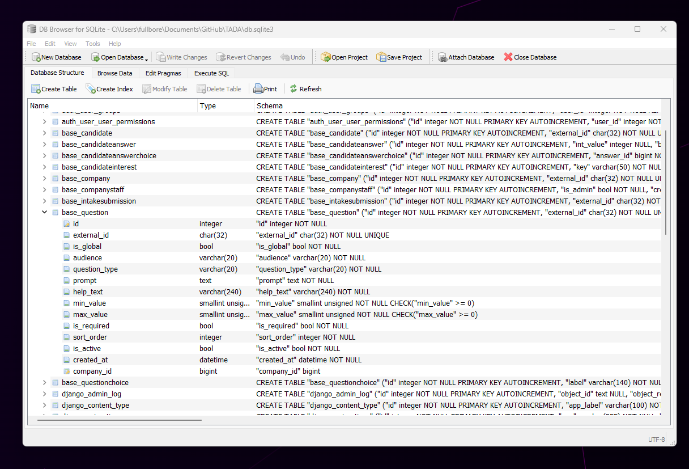

# TADA


Note, the admin user is 
```bash
user: admin
pass: groupb
```
You can add users from http://127.0.0.1:8000/admin/ admin dashboard or via console:

```bash
python manage.py createsuperuser
```

---

# Setup

## Getting started (Poetry)

1) Install Poetry

```bash
pip install poetry
```

2) Install project dependencies (run from project root where manage.py exists)

```bash
poetry install
```

3) Activate the virtual environment

```bash
poetry shell
```

4) Run database migrations ( I am checking in the db.sqlite so you don't have to do this unless you blow away the database and want a new one )

```bash
python manage.py makemigrations
python manage.py migrate
```

5) Start the development server

```bash
python manage.py runserver
```

Open in browser:
http://127.0.0.1:8000/

---


# Database Stuff 
Get this https://sqlitebrowser.org/ if you want to visually poke around the database file *db.sqlite3*

